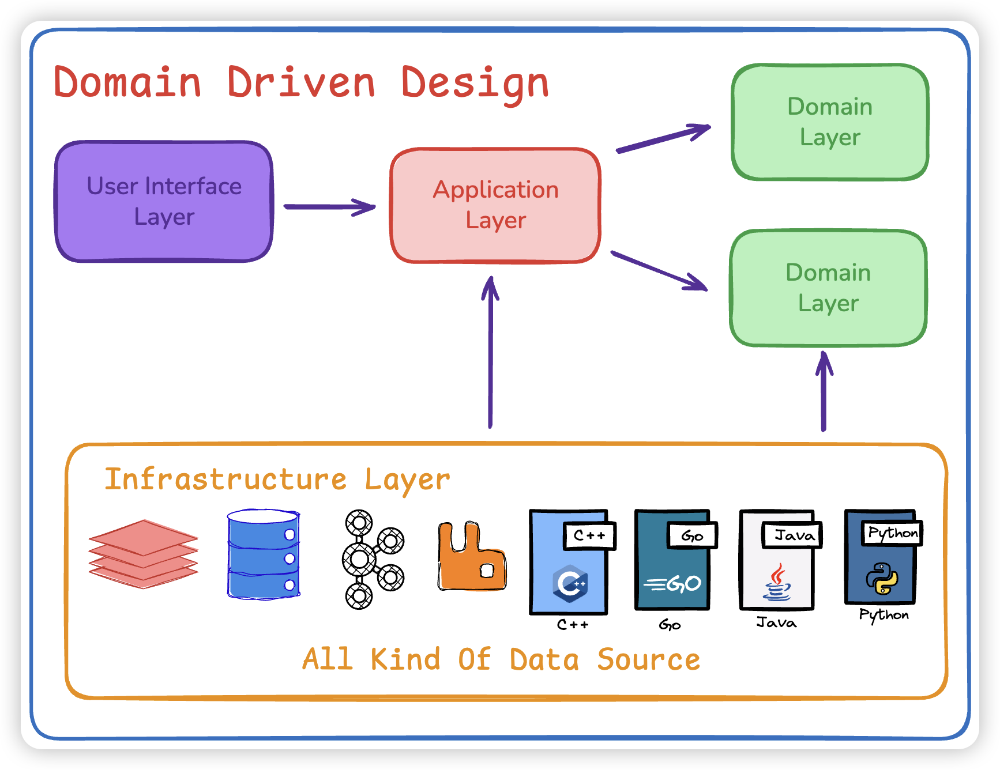

# todolist-ddd
基于 `DDD(Domain Driven Design)` 领域驱动设计 架构实现todolist. 

在此之前也查阅了很多资料，似乎每个人都有自己所理解的DDD。

这里我也只说我自己理解的 DDD，如何和你所理解的有出入，那一定是你对，我理解是错的。

# 功能

非常简单的功能，可以把 docs 下的json文件导入postman中，进行操作即可。

- 用户模块：
  - 注册
  - 登陆
- 备忘录模块：
  - 创建
  - 更新
  - 列表
  - 删除
  - 详情
- 其他模块：
  - 日志打印
  - jwt鉴权
  - cors跨域
  - docker启动环境

# 架构




```shell
./todolist-ddd
├── application         // 应用层: 做domain编排
│   ├── task            // task 应用层模块
│   └── user            // user 应用层模块
├── cmd                 // 启动入口
├── conf                // 配置文件
├── consts              // 常量定义
├── docs                // 接口文档
├── domain              // 领域层: 
│   ├── task            // task 领域层模块
│   │   ├── entity      // task 实体定义及充血对象
│   │   ├── repository  // task 实体的数据持久化接口
│   │   └── service     // task 具体业务逻辑
│   └── user            // user 领域层模块
│      ├── entity       // user 实体定义及充血对象
│      ├── repository   // user 实体的数据持久化接口
│      └── service      // user 具体业务逻辑
├── infrastructure      // 基础架构层: 提供数据来源和基础服务能力
│   ├── auth            // 鉴权认证服务
│   ├── common          // 公共服务
│   │   ├── context     // context 上下游管理
│   │   └── log         // log 服务
│   ├── encrypt         // 加密 服务
│   └── persistence     // 持久层
│       ├── dbs         // db数据连接
│       ├── task        // task 的dao层 访问task数据库
│       └── user        // user 的dao层 访问user数据库
├── interfaces          // 接口层: 对接不同的端进行适配转化
│   ├── adapter         // 适配器
│   │   └── initialize  // Web 路由初始化
│   ├── controller      // controller 层
│   ├── midddleware     // 中间件
│   └── types           // 类型
└── logs                // 日志文件存储
```

整个DDD的大体分成了四层：
- 接口层: 对接不同的端进行适配转化成对应的函数输入到项目中。
- 应用层: 做domain层的业务编排。
- 领域层: 纯业务逻辑，定义各种dao，定义entity充血模型。
- 基础架构层: 提供数据来源和基础服务能力，相当于真正进行操作的dao层。

**⚠️ 有几个很重要的概念：**
1. 充血模型：entity 需要增加对应的业务逻辑方法，而不只是单纯的数据载体。
2. 依赖倒置：可能从MVC的角度，我们看起来是 domain 依赖 infrastructure，因为domain需要infra的数据源来做业务操作。但其实domain只是定义了interface，真正实现这些interface是从infra中实现，而我们一开始启动的时候就会将所有依赖都注入到domain中，所以是一个依赖倒置的关系。
3. 注入依赖：我个人不太喜欢这种注入依赖的方式。虽然说技术实现和语言无关，但对于go来说，我个人比较喜欢函数式编程，而不是面向对象编程。注入依赖是直接注入一个对象中，每个需要依赖的对象都要注入一遍。

# 启动
1. 环境准备

```shell
docker-compose up -f docker-compose.yml
```

2. 启动

```shell
go run cmd/main.go
```
